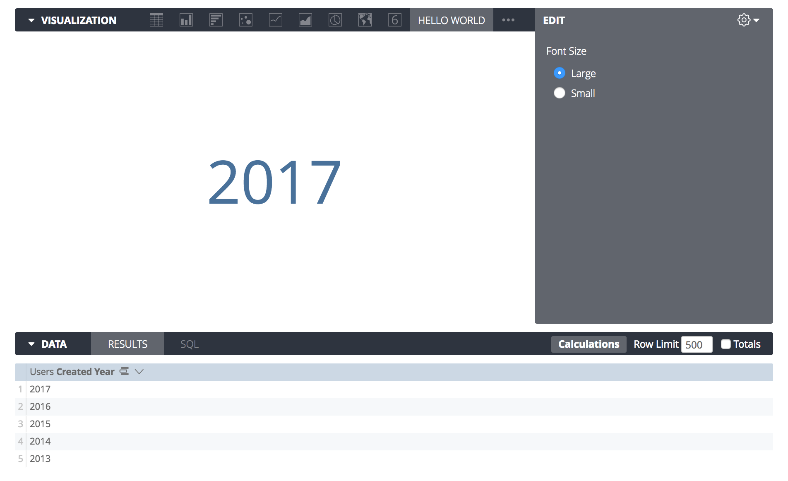

The Looker Visualization API is a pure-JavaScript API that runs in a [sandboxed iframe](https://developer.mozilla.org/en-US/docs/Web/HTML/Element/iframe#attr-sandbox) and is hosted within the Looker application.

The same visualization code can provide a visualization anywhere in Looker: Explores, Looks, dashboards, embeds, or in PDF or rendered images.

Each visualization represents a view of a single Looker query. Looker handles running the query, and passes it to your visualization code. You'll also get passed a DOM element that your visualization code can draw into.

### Requirements

- Some knowledge of JavaScript and web development is necessary. 
- Looker Admin access is required to create and update manifests, but otherwise is not required.

## Hello World

Let's walk thorough creating a simple visualization script.

> For more details on each parameter consult the [Visualization API Reference](api_reference.md).

We'll create a simple "Hello World" visualization that displays the first dimension of a given query. The final result should look like this:



### Setup

To develop and test a visualization in Looker, you need to host your visualization over https and create a manifest with a "Main" file pointing at your IP address and hosting port.

1. `pip install pyhttps` to install a simple https server.
2. `pyhttps` in whichever folder you wish to develop.
3. In Looker, navigate to the Admin page. In the left-hand navigation pane, find the "Platform" section and select "Visualizations".
4. Click "Add Visualization" to create a new manifest.
5. Add a unique id, a label for your visualization (we suggest prefixing it with DEV ONLY so no one creates and saves content with it).
6. Finally, your "Main" file should point at `https://localhost:4443/hello_world.js`.

Now let's actually create `hello_world.js`.

### Just The Bones

If you want to jump to the final source code for this example, [that's available here](../src/examples/hello_world/hello_world.js).

In the folder you are hosting via `pyhttps` open a new blank JavaScript file on your computer and call it `hello_world.js`.

You register a new custom visualization with Looker by calling the `looker.plugins.visualizations.add` function and passing it a visualization object. This object contains the entire definition of your visualization and its configuration UI.

Here's the skeleton of our visualization with all the required properties filled out - just a `create` and `updateAsync` function where we'll write our visualization code:

```js
looker.plugins.visualizations.add({
  create: function(element, config) {

  },
  updateAsync: function(data, element, config, queryResponse, details, done) {

  }
})
```

This is a perfectly valid Looker visualization, but it's not very visual yet. It'll just look like a blank box. But hey, it's a start.

### Setting The Stage

Let's look at the `create` function now. Note it has two arguments: `element` and `config`. We'll just worry about the first one for now.

Looker gives us an `element`, which is the [DOM Element](https://developer.mozilla.org/en-US/docs/Web/API/HTMLElement) that Looker would like us to put our visualization into. Looker will build this element for you and make it the proper size, you just need to put stuff in there.

The `create` function gives us the opportunity to do the initial setup of our element. For our example, we want to create a chart that will look kind of like this HTML:

```html
<style>
  // some styles for our chart
</style>
<div class="hello-world-vis">
  <div>Data Goes Here</div>
</div>
```

Using JavaScript, we can start to insert stuff into our DOM Element to match the structure we're looking for above.

Here's what that looks like fleshed out:

```js
create: function(element, config) {

  // Insert a <style> tag with some styles we'll use later.
  var css = element.innerHTML = `
    <style>
      .hello-world-vis {
        // Vertical centering
        height: 100%;
        display: flex;
        flex-direction: column;
        justify-content: center;
        text-align: center;
      }
    </style>
  `;

  // Create a container element to let us center the text.
  var container = element.appendChild(document.createElement("div"));
  container.className = "hello-world-vis";

  // Create an element to contain the text.
  this._textElement = container.appendChild(document.createElement("div"));

},
```

So we've now got some CSS in there, and we've made our `hello-world-vis` container, and a div inside there.

We've also assigned `this._textElement` to the container we want to render into. That's a convenience so we don't have to look it up again later when the chart begins to render.

That's all we need to do in our `create` function – it's just a convenient place to do setup that only needs to happen once.

### Rendering

It's time to visualize! We'll flesh out our `updateAsync` method now. This method gets called any time the chart is supposed to visualize changes, or when any other event happens that might affect how your chart is rendered. (For example, the chart may have been resized or a configuration option changed.)

In our case, we only need to find the first dimension in the first cell. We can do so using `data`, which is an array of every row of the dataset, and `queryResponse`, which contains metadata about the query, such as field names and types.

We can also use a helper method called `LookerCharts.Utils.htmlForCell` to give us the proper HTML representation of the data point in that cell, which automatically handles things like drill links, formatting, and data actions:

```js
  updateAsync: function(data, element, config, queryResponse, details, done) {

    // Grab the first cell of the data.
    var firstRow = data[0];
    var firstCell = firstRow[queryResponse.fields.dimensions[0].name];

    // Insert the data into the page.
    this._textElement.innerHTML = LookerCharts.Utils.htmlForCell(firstCell);

    // Always call done to indicate a visualization has finished rendering.
    done()
  }
```

:tada: And we're done! That's all we need to do to have a fully-functioning custom visualization.

Let's press on though, and improve the user experience a bit...

### Handling Errors

Our `updateAsync` code is grabbing the first row of data, but what happens if the query returns no results or doesn't contain any dimensions?

Well, currently you'll get an ugly JavaScript error in the browser console, and most users will be confused when the chart doesn't render.

However, it's easy for charts to display custom error messages if they encounter problems while trying to render. Looker will add two functions to your visualization object: `addError` and `clearErrors` that can be used to display a nice error message to the user.

Because they're added to the visualization object, they're available from the context of your `updateAsync` function via the `this` object.

We can just modify the beginning of our `updateAsync` method to detect an error condition, let the user know there's an issue, and bail out instead of trying to render:

```js
  updateAsync: function(data, element, config, queryResponse, details, done) {

    // Clear any errors from previous updates.
    this.clearErrors();

    // Throw some errors and exit if the shape of the data isn't what this chart needs.
    if (queryResponse.fields.dimensions.length == 0) {
      this.addError({title: "No Dimensions", message: "This chart requires dimensions."});
      return;
    }

    // ... the rest of the update code here ...
```

That's it! If the user creates a query that only has measures, they'll now see this:


### Configuration

The final step is to allow users to customize aspects of their visualization.

That's really easy – in addition to the other properties of your visualization object, there's a special property called `options`.

We can use that to specify what kind of options the chart needs:

```js
looker.plugins.visualizations.add({
  options: {
    font_size: {
      type: "string",
      label: "Font Size",
      values: [
        {"Large": "large"},
        {"Small": "small"}
      ],
      display: "radio",
      default: "large"
    }
  },
  // ... rest of visualization object ...
```

Here we've created a `font_size` option that will display as radio buttons, letting users choose between "small" and "large" font sizes.

There are [lots of parameters available for making more complicated options available](api_reference.md#presenting-configuration-ui), but we'll just look at the basics here.

Specifying the `options:` property is all you need to add the option to the visualization picker.

So how do we use it?

Recall that in the `updateAsync` method there's a `config` parameter that gets passed in. This will contain the currently selected options:

```js
updateAsync: function(data, element, config, queryResponse, details, done) {
```

That `config` object looks something like this:

```js
{font_size: "large"}
```

So when we're updating the chart we can easily check that and do stuff in response to it. Here's a check we can add to the end of the update method to implement the font size changes:

```js
if (config.font_size == "small") {
  this._textElement.className = "hello-world-text-small";
} else {
  this._textElement.className = "hello-world-text-large";
}
```

We should also update the `<style>` tag we added in the `create` method to define the `hello-world-text-small` and `hello-world-text-large` CSS classes:

```css
.hello-world-text-large {
  font-size: 72px;
}
.hello-world-text-small {
  font-size: 18px;
}
```

Because the `updateAsync` function gets called any time the config changes, and Looker automatically keeps track of saving the configuration for you, this is all you need to do to respond to any configuration settings you like.

### Doneskies

And that's the basics of how to create a custom visualization using the Visualization API. [You can check out the complete source code to this "Hello World" visualization here](../src/examples/hello_world/hello_world.js).

There's a bunch of additional functionality you can use as well, so definitely take a look at the [Visualization API Reference](api_reference.md) for more information.

Happy visualizing!
