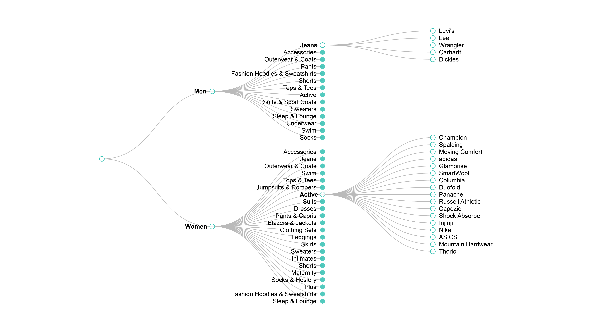

#  Collapsible Tree

This diagram displays a [treemap](https://en.wikipedia.org/wiki/Tree_structure), showing a hierarchy of a series of dimensions.

**How it works**

Create a look with two or more dimensions.

For example, in the collapsible tree diagram featured above, you can see the nested relationship between department, category and brand in an ecommerce catalog.

Include [collapsible_tree.js](/collapsible_tree.js), [utils.js](../common/utils.js) and [d3.v4.js](../common/d3.v4.js)
