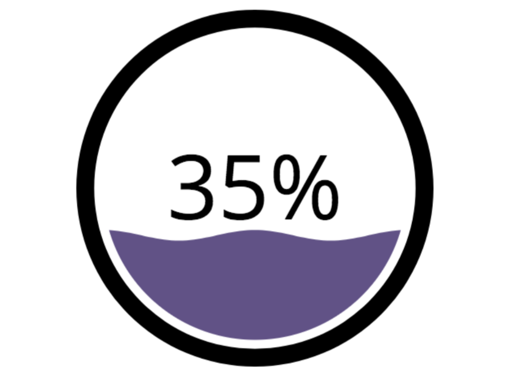

#  Liquid Fill Gauge

 
This diagram displays a liquid fill gauge (LFG), displaying either a single measure value as a percentage, or a comparison of one measure to another measure.

****
add .mov file once we have the lfg working on the looker hosted instance
****

**How it Works**

Create an explore with one or more measures, and no dimensions. 

**More Info**

If compary one measure to another measure, the first measure can be displayed as either a percent of the larger measure or the value itself. The visualization represents a thermometer, filling up as the measure gets closer to equivalence with the larger measure (or 100%).

Including any dimensions in the query will either have no effect or will cause the measure to aggregate at a more granular level, in which case the visualization will display the top (in result grid) value of the first measure, compared to the top value of the second measure. Keep in mind, in such cases ordering may affect which row gets displayed.

