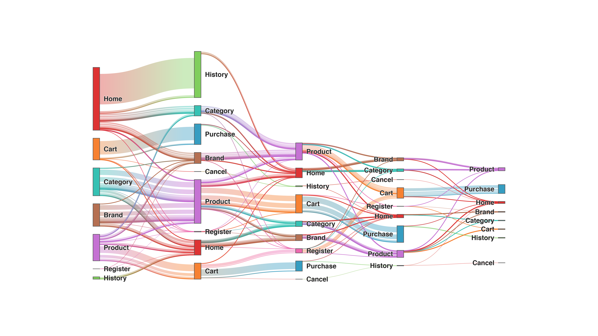

#  Sankey

This diagram creates a [sankey diagram](https://en.wikipedia.org/wiki/Sankey_diagram) to display sequences of transitions.

**How it works**

Create a look with any number of dimensions and one measure.

For example, in the sankey diagram above, you can see event transition counts between the various sequences of states.

## Manifest
id: sankey,
label: Sankey,
Main: sankey.js
Dependencies: https://cdnjs.cloudflare.com/ajax/libs/d3-sankey/0.7.1/d3-sankey.min.js, https://cdnjs.cloudflare.com/ajax/libs/d3/4.13.0/d3.min.js
