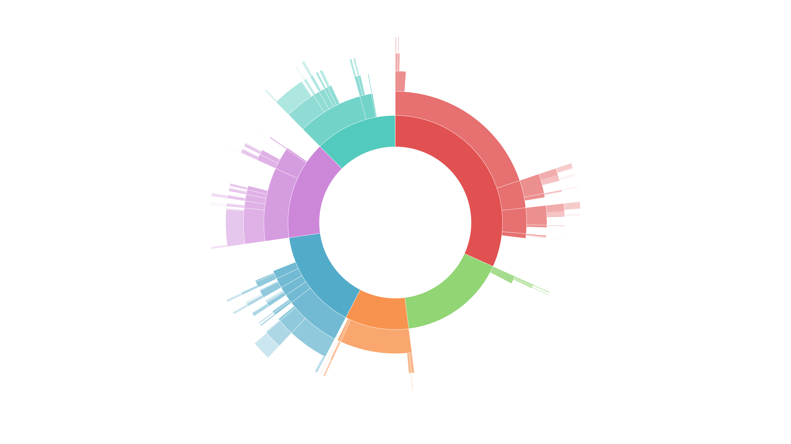

#  Sunburst

This diagram creates a [sunburst](https://en.wikipedia.org/wiki/Pie_chart#Ring_chart_.2F_Sunburst_chart_.2F_Multilevel_pie_chart) to display hierarchical data in a nested structure.

**Implementation Instructions**
Follow the instructions in [Looker's documentation](https://docs.looker.com/admin-options/platform/visualizations). Note that this viz does not require an SRI hash and has no dependencies. Simply create a unique ID, a label for the viz, and paste in the CDN link below.

**CDN Link** 

Paste the following URL into the "Main" section of your Admin/Visualization page. 

https://looker-custom-viz-a.lookercdn.com/master/sunburst.js

**How it works**

Create a look with any number of dimensions and exactly one measure.

For example, in the sunburst featured above, you can see event counts by the hierarchical sequence of events.

**More Info** 

The sunburst chart is represented by one or more complete and partial circles, or rings. The inner-most ring is always complete. Subsequent rings can be complete or fragmented, depending on the presence of data within the first rings’ categories. For example, the first ring may have three categories: completed orders, returned orders, and incomplete orders. On a given day the second ring may include data for both the returned and completed orders, but no data for incomplete orders. The second ring would then be fragmented, represented by a missing section over the first part of the ring representing incomplete orders. 

The sunburst visualization is meant to display data across two or more dimensions. Similar to a collapsible tree, it is best used when comparing data across increasing levels of granularity. There is no limit to the number of dimensions that can be used, but the graph becomes difficult to understand and trace with an overabundance of dimensions. The same issues arise with overly granular data. One category in the first ring that has 50 subcategories associated with it will be difficult to read. 
