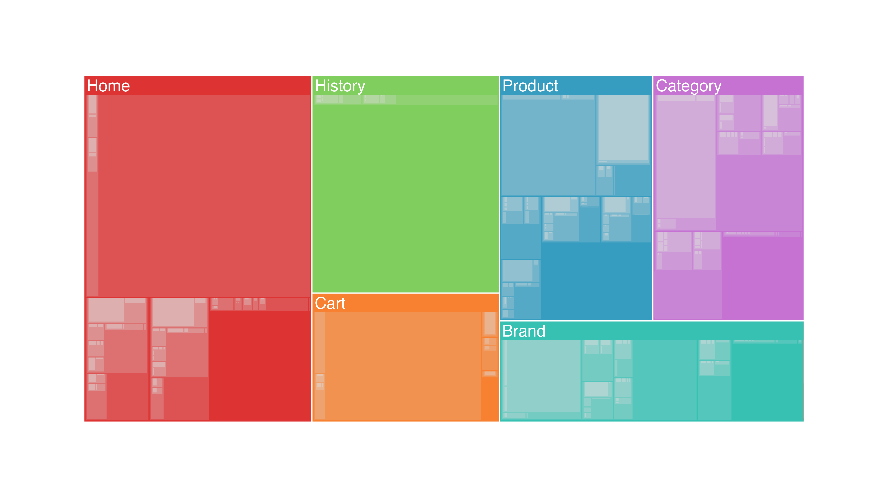

#  Treemap

This diagram creates a [treemap](https://en.wikipedia.org/wiki/Treemapping) to display hierarchical data in a nested structure.

**Implementation Instructions**
Follow the instructions in [Looker's documentation](https://docs.looker.com/admin-options/platform/visualizations). Note that this viz does not require an SRI hash and has no dependencies. Simply create a unique ID, a label for the viz, and paste in the CDN link below.

**CDN Link** 

Paste the following URL into the "Main" section of your Admin/Visualization page. 

https://looker-custom-viz-a.lookercdn.com/master/treemap.js

**How it works**

Create a Look with any amount of dimensions and one measure.

For example, in the treemap featured above, you can see event counts by the hierarchical sequence of events.

**More Info**

The treemap will display categories of data, sized according to the proportion of the measure belonging to each category. From left to right, the chart will nest each dimension included in the query within the previous. It is best used in cases with dimensions that increase in granularity from left to right. 

A good example use case for this chart is an inventory report. A high level category (Dimension) could be "Department", followed by "Product Type", and again followed by "Sku Number". This sequence follows a one-to-many relationship between each dimension, moving from left to right (e.g. there are many product types within one department). Using this pattern, the chart will show large rectangles for the Department, and smaller nested rectangles for Product Type. Finally, the individual Sku numbers and their subsequent count will be nested within each Product Type's rectangle. 
